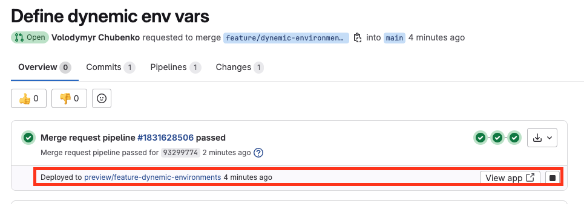

# Section 1: Introduction to GitLab CI/CD. Fundamental CI/CD concepts & DevOps

## 1. Introduction to the GitLab CI/CD course

## 2. What is GitLab CI/CD?

## 3. GitLab.com account registration

- https://medium.com/devops-with-valentine/setup-gitlab-ci-runner-with-docker-executor-on-windows-10-11-c58dafba9191
- https://www.youtube.com/watch?v=HGJWMTNeYqI

Create yopur own gitlab account:

- https://about.gitlab.com/

My account https://gitlab.com/forelock

## 4. Verifying your GitLab account

- https://gitlab.com/forelock/gitlab-for-beginners

## 5. What is a pipeline?

## 6. Your first pipeline

- YAML Syntax: https://learn.getgrav.org/16/advanced/yaml
- Top 10 Bash file system commands you can’t live without: https://hackernoon.com/top-10-bash-file-system-commands-you-cant-live-without-4cd937bd7df1

Created repository: https://gitlab.com/forelock/car-assembly

## 7. Help! My GitLab CI pipeline is not running.

## 8. Adding pipeline stages

Repository: https://gitlab.com/forelock/car-assembly

## 9. GitLab CI/CD architecture

- GitLab Server:
  - Stores the results;
  - Manages the pipelines and the associated jobs;
  - Coordinates the work but delegates the execution
- GitLab Runner:
  - Executes the job

## 10. GitLab CI/CD architecture (Part 2)

## 11. How much does GitLab cost?

- https://medium.com/devops-with-valentine/setup-gitlab-ci-runner-with-docker-executor-on-windows-10-11-c58dafba9191
- https://www.youtube.com/watch?v=HGJWMTNeYqI

## 12. What is a Linux shell?

- https://medium.com/devops-with-valentine/how-to-install-ubuntu-desktop-on-a-virtual-machine-using-virtualbox-7-7ee537b609b9

## 13. Writing comments in a GitLab pipeline

- "# Comment"

## 14. Manually stopping a pipeline

- Use UI buttons for job

## 15. Brief introduction to YAML

## 16. Safeguarding CI pipelines with effective tests

## 17. Why do jobs and pipelines fail (exit codes)

- Exit code: 0 - PASS
- Exit code: 1-255 - FAIL - immediately interapt

Example: sh"exit 1"

## 18. Important skills you need to acquire

## 19. What is DevOps?

## 20. Conclusion

# Section 2: Continuous Integration (CI) with GitLab (Stages, Tests, Reports, Merge Requests)

## 21. Introduction to Continuous Integration (CI)

- Git for GitLab (Beginner's FULL COURSE)[https://www.youtube.com/watch?v=4lxvVj7wlZw]

git --version
mkdir git-study
cd git-study
git init
git status
git config --global user.name "Valentin Despa"
git config --global user.email "valentin.despa@example.com"
vim readme.md
git add readme.md
git status
git commit -m "My first commit"
git status
git add . --- add to stage all files

Staging is usefull for check what ind of files we want to commit
git reset HEAD readme.md --- unstage readme.md file only to omit commiting it
git log --- logging commits history
git log --patch --- with more information

Git doesn't track folders. If you need to track it add file inside ".gitkeep"
touch temp/.gitkeep
git status

git checkout -b feature/new-table --- create new branch and checkout
git branch -d feature/new-table --- delete branch

git checkout master
git merge feature/new-table --- if there are no any changes in master, merge automaticaly will be executed with 'fast-forward' startegy
git log
git branch

If if there are some changes in master, merge will be executed with other startegy and require merge commit

git checkout bugfix/table-2
git rebase master

git merge --abort
git rebase --abort

Resolve conflick will create new commit as a result.

## 22. Forking a Git repository

Need to fork project: https://gitlab.com/gitlab-course-public/learn-gitlab-app
My forked project: https://gitlab.com/forelock/learn-gitlab-app

## 23. Running the project locally (optional)

- https://nodejs.org/en/download
- https://code.visualstudio.com/
- https://git-scm.com/
- https://www.youtube.com/watch?v=iXuIp5uNnLk
- https://www.youtube.com/watch?v=Vmt0V6a3ppE
- https://www.youtube.com/watch?v=_qDJ0W1wR5w

npm i
npm run build --- to build(bundle) the project
npm install -g serve --- install globally simple web-server to test project locally
serve -s build/

## 24. Using Docker as a build environment

test_npm:
image: node:22
script: - node --version - npm --version

## 25. Choosing an appropriate Docker image

- https://hub.docker.com/

## 26. Lightweight Docker images (alpine, slim)

Every docker image should be downloaded. So always need to find lighter images

choose image: image: node:22-alpine(the lightest) or node:22-slim(lighter) instead of image: node:22
Time of job execution has been reduced in TWICE (from 30sec to 15sec) after usage of node:22-alpine instead of node:22

## 27. Building the project using GitLab

Use `npm ci` instead of `npm install`. It's optimized for ci and uses dependencies from `package-lock.json`, but not `package.json`.

stages:

- build

test_npm:
image: node:22-alpine
stage: build
script: - node --version - npm --version - npm ci - npm run build

## 28. Assignment: Publishing build artifacts

- https://docs.gitlab.com/ci/jobs/job_artifacts/
- https://docs.gitlab.com/ci/yaml/#artifacts

## 29. Assignment: Publishing build artifacts

stages:

- build

test_npm:
image: node:22-alpine
stage: build
script: - node --version - npm --version - npm ci - npm run build
artifacts:
paths: - build/

## 30. Revisiting the GitLab CI/CD architecture

1.  GitLab Server find GitLab Runner and give its instructions
2.  Executing job on the runner in Docker container
3.  Save artifacts on GitLab Server

One docker container is used ONLY for one JOB

## 31. Assignment: Adding a test stage

## 32. Assignment: Adding a test stage - Solution

stages:

- build
- test

build_website:
....

test_artifact:
image: alpine
stage: test
script: - echo "Testing" - test -f "build/index.html"

## 33. Running unit tests

stages:

- build
- test
- unit

...

unit_tests:
image: node:22-alpine
stage: unit
script: - npm ci - npm test

## 34. Running jobs in parallel

stages:

- build
- test

...

test_artifact:
image: alpine
...

unit_tests:
image: node:22-alpine
stage: test
...

## 35. Default pipeline stages (.pre, build, test, deploy .post)

GitLab define next stages by default and you can omit `stages` declaration:

stages:

- .pre
- build
- test
- deploy
- .post

## 36. Publishing a JUnit test report

- https://docs.gitlab.com/ci/yaml/#artifactsreports
- https://docs.gitlab.com/ci/testing/unit_test_reports/
- https://docs.gitlab.com/ci/testing/unit_test_report_examples/

...
unit_tests:
image: node:22-alpine
stage: test
script: - npm ci - npm test
artifacts:
when: always
reports:
junit: reports/junit.xml

## 37. Testing the tests (ensure that the tests fail!)

## 38. How to integrate changes?

- https://sisense.udemy.com/course/gitlab-ci-pipelines-ci-cd-and-devops-for-beginners/learn/lecture/48223617#overview

## 39. Configuring Merge Requests

Fast-Forward merge, encourage squash, Protect branch.

## 40. Making changes through a Merge Request

- https://gitlab.com/forelock/learn-gitlab-app/-/merge_requests/1

## 41. Code review and merging changes

- https://gitlab.com/forelock/learn-gitlab-app/-/merge_requests/1

## 42. Configuring a code linter

- https://docs.gitlab.com/ci/testing/code_quality/#eslint
- https://www.npmjs.com/package/eslint-formatter-gitlab
  Copy code of stage:
  ...
  eslint:
  image: node:20-alpine
  script: - npm ci - npx eslint --format gitlab .
  artifacts:
  reports:
  codequality: gl-codequality.json --- new widget in GitLab MR
  ...

## 43. How to structure a pipeline?

If there is quick/fast stages, like eslint put it as soon a possible to reduce time execution if fails

## 44. Simplifying the pipeline

Put `.` to disable stage execution

.test_artifact:
image: alpine
stage: test
script: - echo "Testing" - test -f "build/index.html"

You can override stage just define it with the same name after.

# Section 3: Continuous Deployment (CD) with GitLab

## 46. Section Overview

- https://app.netlify.com/signup

## 47. Manual deployment

- https://app.netlify.com/sites/forelock-learn-gitlab/overview

## 48. Installing CLI tools

- https://docs.netlify.com/cli/get-started/

...
netlify:
image: node:22-alpine
stage: .pre
script: - npm install -g netlify-cli - netlify --version

## 49. Storing project configuration in environment variables

- https://cli.netlify.com/commands/deploy/ (find vars -> NETLIFY_AUTH_TOKEN and NETLIFY_SITE_ID)

Define env var for job:
....
netlify:
image: node:22-alpine
stage: .pre
variables:
NETLIFY_SITE_ID: 'f580bcf5-9536-48bd-8426-7cf7dbe9c16b'
script: - npm install -g netlify-cli - netlify --version - echo "Deploying to site id $NETLIFY_SITE_ID"

## 50. Managing secrets

Go to Netlify in the progect:
User settings -> OAuth -> Personal access tokens -> Genarate token

Go to GitLab:
Project -> Settings -> CI/CD -> Variables
Create variable with 'Masked and hidden visibility', 'Protect variable'=false, 'Expand variable reference'=false
NETLIFY_AUTH_TOKEN='Generated token' (https://cli.netlify.com/commands/deploy/)

## 51. Managing secrets

???

## 52. Best practices for handling credentials

## 53. Deploying to production

- https://cli.netlify.com/commands/deploy/
- https://docs.netlify.com/site-deploys/create-deploys/#netlify-cli

....
netlify:
image: node:22-alpine
stage: deploy
variables:
NETLIFY_SITE_ID: 'f580bcf5-9536-48bd-8426-7cf7dbe9c16b'
script: - npm install -g netlify-cli - netlify --version - netlify status - echo "Deploying to site id $NETLIFY_SITE_ID" - netlify deploy --prod --no-build --dir=build

## 54. Smoke tests

## 55. Conditional job execution with rules:

- https://docs.gitlab.com/ci/yaml/#rules
- https://docs.gitlab.com/ci/variables/predefined_variables/

...
netlify:
image: node:22-alpine
stage: deploy
rules: - if: $CI_COMMIT_REF_NAME == $CI_DEFAULT_BRANCH
...

where:
CI_COMMIT_REF_NAME - The branch or tag name for which project is built. (Pre-pipeline)
CI_DEFAULT_BRANCH - The name of the project’s default branch. (Pre-pipeline)

## 56. Scripts: before_script and after_script

- https://docs.gitlab.com/ci/yaml/#before_script
- https://docs.gitlab.com/ci/yaml/#after_script

default:
before_script: - echo "This is executed in all jobs"
...

netlify:
image: node:22-alpine
....
before_script: - npm install -g netlify-cli - apk add curl
script: - netlify --version
....

## 57. Deployment Strategies: Non-production environments

## 58. Deploying to the staging environment

netlify_staging:
image: node:22-alpine
stage: deploy_staging
rules: - if: $CI_COMMIT_REF_NAME == $CI_DEFAULT_BRANCH
before_script: - npm install -g netlify-cli - apk add curl
script: - netlify --version - netlify status - echo "Deploying to site id $NETLIFY_SITE_ID" - netlify deploy --alias=staging --no-build --dir=build - curl 'https://staging--forelock-learn-gitlab.netlify.app/' | grep 'GitLab'

netlify_prod:
image: node:22-alpine
stage: deploy_prod
rules: - if: $CI_COMMIT_REF_NAME == $CI_DEFAULT_BRANCH
before_script: - npm install -g netlify-cli - apk add curl
script: - netlify --version - netlify status - echo "Deploying to site id $NETLIFY_SITE_ID" - netlify deploy --prod --no-build --dir=build - curl 'https://forelock-learn-gitlab.netlify.app/' | grep 'GitLab'

## 59. Manual approval step before deploying to production

netlify_prod:
image: node:22-alpine
stage: deploy_prod
when: manual ----- !!!!
rules: - if: $CI_COMMIT_REF_NAME == $CI_DEFAULT_BRANCH

## 60. Continuous Delivery and Continuous Deployment

Continuous Delivery - require manual deploying to production

Continuous Deployment - deploys app into production automatically without any manual actions

## 61. Creating review environments

- https://docs.gitlab.com/ci/review_apps/

With

...
netlify_review:
image: node:22-alpine
stage: deploy_review
before_script: - npm install -g netlify-cli
script: - netlify --version - netlify status - echo "Deploying to site id $NETLIFY_SITE_ID" - netlify deploy --no-build --dir=build
....

## 62. Merge request pipeline vs Branch pipeline

- https://medium.com/devops-with-valentine/fix-gitlab-ci-duplicate-pipelines-in-merge-requests-when-using-rules-9a1486994f3a
- https://docs.gitlab.com/ci/pipelines/merge_request_pipelines/
- https://docs.gitlab.com/ci/yaml/workflow/

Setting up globally on the top of the file:

workflow:
rules: - if: '$CI_PIPELINE_SOURCE == "merge_request_event"' ----- Control when merge request pipelines run. - if: $CI_COMMIT_BRANCH == $CI_DEFAULT_BRANCH
....

## 63. Parsing CLI response data (w/ jq JSON parser)

- https://jqlang.org/

netlify_review:
image: node:22-alpine
stage: deploy_review
rules:

- if: $CI_COMMIT_REF_NAME != $CI_DEFAULT_BRANCH
  before_script:
  - npm install -g netlify-cli
  - apk add curl jq ----- 'jq' is to parse json
    script:
  - netlify --version
  - netlify status
  - echo "Deploying to site id $NETLIFY_SITE_ID"
  - netlify deploy --no-build --dir=build --json | tee deploy-result.json ---- netlify cli output as json and then tee outout to consol and write into json file
  - cat deploy-result.json
  - REVIEW_URL=$(jq -r '.deploy_url' deploy-result.json) ---- prase json and extract value
  - echo $REVIEW_URL
  - curl $REVIEW_URL | grep 'GitLab'

## 64. Defining dynamic environments

- https://docs.gitlab.com/ci/yaml/artifacts_reports/#artifactsreportsdotenv
- https://docs.gitlab.com/ci/environments/#set-a-dynamic-environment-url
- https://docs.gitlab.com/ci/variables/predefined_variables/

netlify_review:
image: node:22-alpine
stage: deploy_review
rules:

- if: $CI_COMMIT_REF_NAME != $CI_DEFAULT_BRANCH
  environment:    ----!!!!
    name: preview/$CI_COMMIT_REF_SLUG
  url: $REVIEW_URL
  before_script:
  - npm install -g netlify-cli
  - apk add curl jq
    script:
  - netlify --version
  - netlify status
  - echo "Deploying to site id $NETLIFY_SITE_ID"
  - netlify deploy --no-build --dir=build --json | tee deploy-result.json
  - cat deploy-result.json
  - REVIEW_URL=$(jq -r '.deploy_url' deploy-result.json)
  - echo $REVIEW_URL
  - curl $REVIEW_URL | grep 'GitLab'
  - echo "REVIEW_URL=$REVIEW_URL" > deploy.env ---- !!!!
  - cat deploy.env
    artifacts: ------!!!!
    reports:
    dotenv: deploy.env



## 65. Defining static environments

- https://docs.gitlab.com/ci/environments/
  To se the existing static envs go to: Project -> Operate -> Environments
  Also those envs will be seen on MRs

netlify_staging:
....
environment:
name: staging
url: 'https://staging--forelock-learn-gitlab.netlify.app/'
....
script:
.... - curl $CI_ENVIRONMENT_URL | grep 'GitLab'

netlify_prod:
....
environment:
name: production
url: 'https://forelock-learn-gitlab.netlify.app/'
....
script:
.... - curl $CI_ENVIRONMENT_URL | grep 'GitLab'

## 66. Scoping variables to a specific environment

It's possible to set up env vars for particular env:
Project -> Settings -> CI/CD -> Variables
Each var could be set up for all envs or particular env

## 67. Project simulation using merge requests

## 68. End-to-end tests with ​​Playwright (E2E tests)

- https://playwright.dev/
- https://playwright.dev/docs/docker

e2e:
stage: .pre
image: mcr.microsoft.com/playwright:v1.49.1-noble
variables:
APP_BASE_URL: 'https://forelock-learn-gitlab.netlify.app/'
script: - npm ci - npm run e2e

## 69. Passing data between jobs with environment variables

netlify_review:
.... - echo "REVIEW_URL=$REVIEW_URL" > deploy.env
artifacts:
reports:
dotenv: deploy.env

e2e:
...
variables:
APP_BASE_URL: $REVIEW_URL
...

## 70. Assignment: Publishing the E2E JUnit report

...
artifacts:
when: always
paths: - reports/
reports:
junit: reports/playwright-junit.xml

## 72. Publishing an HTML report

For now just add it to artifacts and browse them there
...
artifacts:
when: always
paths: - reports/

## 73. Setting a build version

src/App.jsx
...

<p className="read-the-docs">
Application version: {import.meta.env.VITE_APP_VERSION}
</p>

.gitlab-ci.yml
...
variables:
VITE_APP_VERSION: $CI_COMMIT_SHORT_SHA

## 74. A critical analysis of the pipeline

## 75. Why CI/CD really matters

# Section 4: Introduction to Docker for DevOps

## 77. Section overview

Created new reposytory:

- https://gitlab.com/forelock/learn-gitlab-app-2

Setup environments

- https://docs.gitlab.com/ci/environments/
  To se the existing static envs go to: Project -> Operate -> Environments

- Add variable:
  NETLIFY_AUTH_TOKEN

## 78. Creating a Dockerfile

ci/Dockerfile
....
FROM: node:22-alpine
RUN npm install -g netlify-cli
RUN apk add curl

## 79. Running Docker CLI commands in GitLab

...
test_docker:
stage: .pre
image: docker:28
services: - docker:28-dind
script: - docker --version - docker version
...

image: docker:28 - This specifies the Docker image to be used for this job.

- docker:28 is an official Docker image tagged with version 28.
- It provides the necessary tools (like the Docker CLI) to interact with Docker from within the pipeline.

services: - Services are additional containers that run alongside the job container. These are used for dependencies that the job needs to interact with.

- docker:28-dind (Docker-in-Docker) is a service that allows Docker commands to run inside the CI/CD job's container. It spins up a Docker daemon inside the container, so you can run Docker commands like docker build, docker run, etc., within the job.
- dind is the shorthand for Docker-in-Docker, which enables you to build and test Docker images within the pipeline.

docker --version: This command prints the version of the Docker CLI installed in the container.
docker version: This command provides detailed information about the Docker client and server (daemon) versions, as well as other Docker-related details like API version and supported features.

## 80. Building a Docker image

ci/Dockerfile
FROM node:22-alpine
RUN npm install -g netlify-cli
RUN apk add curl

.gitlab-ci.yml
...
build_docker_netlify:
stage: .pre
image: docker:28
services: - docker:28-dind
script: - docker version - docker build -t netlify -f ci/Dockerfile . - docker image ls
...

## 81. GitLab container registry

...
script: - docker version - echo $CI_REGISTRY_PASSWORD | docker login -u $CI_REGISTRY_USER --password-stdin $CI_REGISTRY
....

## 82. Pushing an image to the GitLab container registry

...

- docker build -t $CI_REGISTRY_IMAGE/netlify -f ci/Dockerfile .
- docker image ls
- docker push $CI_REGISTRY_IMAGE/netlify
  ...

## 83. Using a custom Docker image in the pipeline

netlify_prod:
image: $CI_REGISTRY_IMAGE/netlify

## 84. Create a scheduled pipeline

build_docker_netlify:
stage: .pre
image: docker:28
rules: - if: '$CI_PIPELINE_SOURCE == "schedule"'
...

This job disappears from pipeline

Go to Project/Build/Pipeline schedule
Set to run pipeline by schedule and in this case 'build_docker_netlify' job will be executed within pipeline

# Section 5: Continuous Deployment to AWS (AWS CLI, IAM, S3) with GitLab

## 86. Introduction to Amazon Web Services (AWS)

## 87. Amazon S3 (object storage)

Create S3 bucket:

- https://us-east-1.console.aws.amazon.com/s3/buckets/learn-gitlab-20250618?region=us-east-1&tab=objects&bucketType=general

## 88. AWS CLI

- https://gitlab.com/-/ide/project/forelock/learn-gitlab-app-2/

aws_s3:
stage: .pre
image:
name: amazon/aws-cli:2.27.37
entrypoint: [""]
script: - aws --version

entrypoint - we can override entry point of image, because amazon/aws-cli returns 'aws'

## 89. Managing AWS services with AWS CLI

## 90. Identity management with AWS IAM

Use IAM service to setup user and permissions:
https://us-east-1.console.aws.amazon.com/iam/home?region=us-east-1#/home

IAM -> Users -> Create user -> name 'gitlab' -> Attach policies -> AmazonS3FullAccess -> Create user

Open created user -> Create 'Access key' -> Use case 'Command Line Interface (CLI)' -> Done(DO NOT CLICK TILL YOU COPY Secret Key)

Access key best practices:

- Never store your access key in plain text, in a code repository, or in code.
- Disable or delete access key when no longer needed.
- Enable least-privilege permissions.
- Rotate access keys regularly.
  For more details about managing access keys, see the best practices for managing AWS access keys.

## 91. Managing AWS credentials in GitLab - Assignment

Need to find what kind of Env Var we should use to define access key
https://docs.aws.amazon.com/cli/latest/topic/config-vars.html

## 92. Managing AWS credentials in GitLab - Assignment Solution

- https://docs.aws.amazon.com/cli/latest/topic/config-vars.html#credentials

Add to GitLab/Settings/CICD/Variables:

AWS_ACCESS_KEY_ID=<Access Key> (Visibility, Flags-Protect variable=true, Expand variable reference=false)
AWS_SECRET_ACCESS_KEY=<Secret access Key> (Masked and hidden, Flags-Protect variable=true, Expand variable reference=false)

Now s3 bucket will be available for GitLab Ci/CD

## 93. Uploading a file to S3

Add var to GitLab:
AWS_S3_BUCKET=learn-gitlab-20250618

`aws_s3:
  stage: .pre
  image: 
    name: amazon/aws-cli:2.27.37
    entrypoint: [""]
  script:
    - aws --version
    - echo "<h1>Hello S3!</h1>" -> index.html
    - aws s3 cp index.html s3://$AWS_S3_BUCKET/index.html`

## 94. Hosting a website on S3

1. Open your s3 bucket (learn-gitlab-20250618 ) -> Properties -> Enable Static website hosting
   Hosting type=Host a static website
   Index document=index.html
   Save
   Static website hosting - http://learn-gitlab-20250618.s3-website-us-east-1.amazonaws.com/

2. Open your s3 bucket (learn-gitlab-20250618 ) -> Permissions
   Block public access (bucket settings) = Off

3. Open your s3 bucket (learn-gitlab-20250618 ) -> Permissions
   Bucket policy -> Edit
   Add s3 service and Add action = GetObject; Add Principal=\* and Add resource

`{
	"Version": "2012-10-17",
	"Statement": [
		{
			"Sid": "Statement2",
			"Principal": "*",
			"Effect": "Allow",
			"Action": [
				"s3:GetObject"
			],
			"Resource": [
				"arn:aws:s3:::learn-gitlab-20250618/*"
			]
		}
	]
}`

## 95. Syncing files to S3

- https://docs.aws.amazon.com/cli/latest/reference/s3/sync.html

`aws_s3:
  stage: deploy
  image: 
    name: amazon/aws-cli:2.27.37
    entrypoint: [""]
  script:
    - aws --version
    - aws s3 sync ./build s3://$AWS_S3_BUCKET`

Now we have deployed our site on s3 bucket hosting

## 96. Conclusion

We made s3 hosting just for example how to work with AWS CLI and AWS S3

# Section 6: Deploying over SSH to a remote server with GitLab (SSH, SCP, rsync)

## 97. Amazon Elastic Compute Cloud (EC2)

## 98. Creating an Ngnix web server

Create free EC2 instance and connect to it via SSH. Execute next commands:

sudo dnf install -y nginx
sudo systemctl start nginx
sudo systemctl enable nginx
sudo systemctl status nginx

then you can open web site by public IP or domain name using http only

## 99. Testing the connection with netcat (nc)

Checking that 22 port is open:
% nc -zv 3.91.178.79 22
Connection to 3.91.178.79 port 22 [tcp/ssh] succeeded!

## 100. 25 - Testing the SSH connection from GitLab

Add env var to CI/CD:
REMOTE_DEPLOY_HOST=ec2-3-91-178-79.compute-1.amazonaws.com

`ssh_deploy:
  stage: .pre
  image: alpine
  script:
    # Check if port 22 open on the server
    - nc -zv $REMOTE_DEPLOY_HOST 22`

## 101. Storing the SSH private key in GitLab

`ssh_deploy:
  stage: .pre
  image: alpine
  script:
    # Check if port 22 open on the server
    - nc -zv $REMOTE_DEPLOY_HOST 22
    # Grand read-only permission to the private key
    - chmod 400 $SSH_PRIVATE_KEY`

## 102. Configuring the SSH connection

`ssh_deploy:
  stage: .pre
  image: alpine
  script:
    # Check if port 22 open on the server
    - nc -zv $REMOTE_DEPLOY_HOST 22
    # Grand read-only permission to the private key
    - chmod 400 $SSH_PRIVATE_KEY
    # Install the OpenSSh client
    - apk add openssh-client
    # Start the SSH agent
    - eval  $(ssh-agent)
    # Add the SSH key to the agent
    - ssh-add $SSH_PRIVATE_KEY
    # Open SSH connection
    - ssh -o StrictHostKeyChecking=no $REMOTE_DEPLOY_USER@$REMOTE_DEPLOY_HOST`

## 103. Verifying the SSH host keys

Run on host command with public IP:
$ ssh-keyscan 35.175.145.136

Create env var (File, Visible, all flags = false) with copied 2 lines from previous command:
SSH_KNOWN_HOSTS=35.175.145.136 ecdsa-sha2-nistp256 fbdhjsbvhjgbhrbvhjsdbnvkjndjkvhjrbvjhs bdb/nDAvzcPQaxRiFzs=
35.175.145.136 ssh-ed25519 hncjkdshcjhdsjvhdjhvjdjsvjds/cc1Ci4ldLanKHieu8

Run next command with Public DNS:
$ ssh-keyscan ec2-35-175-145-136.compute-1.amazonaws.com

Add to SSH_KNOWN_HOSTS env var 2 more lines with DNS
ec2-35-175-145-136.compute-1.amazonaws.com ecdsa-sha2-nistp256 AAAAE2VjZHNhLXNoYTItbmlzdHAyNTYAAAAIbmlzdHAyNTYAAABBBMn3anhc2bemgiPipn3wKmm2XxL8u5SzXtBk7GpFde1kNSqDP32GgtUB9EJOYmkmXOTLgjZ/nDAvzcPQaxRiFzs=
ec2-35-175-145-136.compute-1.amazonaws.com ssh-ed25519 AAAAC3NzaC1lZDI1NTE5AAAAIOoflBLVpHaMwx7wRQ3YtrC12R/cc1Ci4ldLanKHieu8

Update ci/cd script:
`ssh_deploy:
  stage: .pre
  image: alpine
  script:
    # Check if port 22 open on the server
    - nc -zv $REMOTE_DEPLOY_HOST 22
    # Grand read-only permission to the private key
    - chmod 400 $SSH_PRIVATE_KEY
    # Install the OpenSSh client
    - apk add openssh-client
    # Start the SSH agent
    - eval  $(ssh-agent)
    # Add the SSH key to the agent
    - ssh-add $SSH_PRIVATE_KEY
    # Create the SSH directory and assign the right permissions - NEW!!!!
    - mkdir -p ~/.ssh
    - chmod 700 ~/.ssh
    # Create the known_hosts files and assign the right permissions - NEW!!!!
    - cp $SSH_KNOWN_HOSTS ~/.ssh/known_hosts
    - chmod 644 ~/.ssh/known_hosts
    # Open SSH connection
    - ssh -o StrictHostKeyChecking=no $REMOTE_DEPLOY_USER@$REMOTE_DEPLOY_HOST`

## 104. Running commands over SSH

Move preparation commands to before_script:
`ssh_deploy:
  stage: .pre
  image: alpine
  before_script:
    # Check if port 22 open on the server
    - nc -zv $REMOTE_DEPLOY_HOST 22
    # Grand read-only permission to the private key
    - chmod 400 $SSH_PRIVATE_KEY
    # Install the OpenSSh client
    - apk add openssh-client
    # Start the SSH agent
    - eval  $(ssh-agent)
    # Add the SSH key to the agent
    - ssh-add $SSH_PRIVATE_KEY
    # Create the SSH directory and assign the right permissions
    - mkdir -p ~/.ssh
    - chmod 700 ~/.ssh
    # Create the known_hosts files and assign the right permissions
    - cp $SSH_KNOWN_HOSTS ~/.ssh/known_hosts
    - chmod 644 ~/.ssh/known_hosts
    # Open SSH connection
    - ssh -o StrictHostKeyChecking=no $REMOTE_DEPLOY_USER@$REMOTE_DEPLOY_HOST
  script:
    # Open SSH connection + run commands
    - ssh $REMOTE_DEPLOY_USER@$REMOTE_DEPLOY_HOST "whoami; touch /tmp/foo.txt; ls -l /tmp"`

## 105. Uploading files using SCP

Prepare nginx dir on host to upload build directory(Replace root user by ec2-user as owner):
$ ls -l /usr/share/nginx/html/
$ sudo chown -R ec2-user:ec2-user /usr/share/nginx/html/
$ ls -l /usr/share/nginx/html/

`ssh_deploy:
  stage: deploy
  ...
  script:
    # Open SSH connection + run commands
    - ssh $REMOTE_DEPLOY_USER@$REMOTE_DEPLOY_HOST "whoami; touch /tmp/foo.txt; ls -l /tmp"
    # Copy all the directories and files from the build directory (but not build itself) to the remote destination
    - scp -r build/* $REMOTE_DEPLOY_USER@$REMOTE_DEPLOY_HOST:/usr/share/nginx/html/`

## 106. Uploading fiels using rsync

rsync is better than scp. It allows to sync content in dir between local and remote host.

` ....  
  before_script:
    ...
    # Install the OpenSSh client, rsync
    - apk add openssh-client rsync
    ...
  script:
    ...
    # Copy all the directories and files from the build directory (but not build itself) to the remote destination
    - rsync -rvz --delete build/ $REMOTE_DEPLOY_USER@$REMOTE_DEPLOY_HOST:/usr/share/nginx/html/`

## 107. Running a deployment script

Use deploy.sh script:
./deploy.sh

`ssh_deploy:
  stage: deploy
  image: alpine
  before_script:
...
    # Install the OpenSSh client, rsync, zip
    - apk add openssh-client rsync zip
...
  script:
....
    - zip -r build.zip build/
    - scp build.zip ci/deploy.sh $REMOTE_DEPLOY_USER@$REMOTE_DEPLOY_HOST:~/deploy
    - ssh $REMOTE_DEPLOY_USER@$REMOTE_DEPLOY_HOST "cd ~/deploy; chmod +x deploy.sh; ./deploy.sh"`

# Section 7: Continuous Deployment to Amazon Elastic Container Service (ECS, ECR, IAM)

## 109. Introduction to Amazon Elastic Container Service (Amazon ECS)

1. Create cluster
2. Create task definition
3. Run the task definition

## 110. ECS Infrastructure / Launch modes (Fargate vs EC2)

https://us-east-1.console.aws.amazon.com/ecs/v2/getStarted?region=us-east-1

It's paid service!!!
Here is calculator:

- https://calculator.aws/#/createCalculator/Fargate

## 111. Creating a cluster in ECS

Cluster name = LearnGitLabApp-Cluster-Prod (Name of application, 'Cluster' and for which env)
Default namespace = LearnGitLabApp-Cluster-Prod
Infrastructure = AWS Fargate (serverless)
Create and wait.

If there are no any tasks running, it's not charged.

## 112. Creating a task definition

Create task definition
Create using JSON
Hover over each property and read docs.

Use nginx:1.29.0-alpine docker container
https://hub.docker.com/layers/library/nginx/1.29.0-alpine/images/sha256-2598e977ffd4c4cac6fe01ccab90e30186baa34ccea11a2f0e71938571f19da1

https://docs.aws.amazon.com/AmazonECS/latest/developerguide/task_definition_parameters.html?icmpid=docs_ecs_hp-taskdef-create-json

`{
"requiresCompatibilities": [
"FARGATE"
],
"family": "LearnGitLabApp-TD-Prod",
"containerDefinitions": [
{
"name": "learngitlabapp",
"image": "nginx:1.29.0-alpine",
"portMappings": [
{
"name": "nginx-80-tcp",
"containerPort": 80,
"hostPort": 80,
"protocol": "tcp",
"appProtocol": "http"
}
],
"essential": true
}
],
"volumes": [],
"networkMode": "awsvpc",
"memory": "512",
"cpu": "256",
"executionRoleArn": ""
}`

## 113. Creating a deployment on ECS

Open created cluster and got to Services;
Create Service
Task definition family = LearnGitLabApp-TD-Prod
Service name = LearnGitLabApp-Service-Prod
Compute options = Capacity provider strategy
Desired tasks = 1
Networking
Public IP = On
Desired tasks = 0 (TO AVOID RECREATION OF TASKS AFTER STOPPING)

Go to Clusters - Services - Task
Find Public IP

In task update Security rule:
Task - Networking - Security group
Edit Inbound rules - Add rule: Type=HTTP, Source=Anywhere-IPv4

Open Public IP and see NGINX welcome page

STOP task not to charged!!!

## 114. Updating the task definition using AWS CLI

- https://docs.aws.amazon.com/cli/latest/reference/ecs/register-task-definition.html

Create new revission via UI or via GitLab CI json. Let's do it via GitLab:

Add new var to CI/CD:
AWS_DEFAULT_REGION=us-east-1

Add permissions for gitlab user to work with ecs
IAM -> Users -> Add permission -> Attach policies directly -> Search for 'ecs' -> add AmazonECS_FullAccess

Update image version in JSON:
aws/td-prod.json
`....
"containerDefinitions": [
{
"name": "learngitlabapp",
"image": "nginx:1.29.0-alpine",
...`

Add GotLab job:
...
`ecs_deploy:
stage: .pre
image:
name: amazon/aws-cli:2.27.47
entrypoint: [""]
script: - aws --version - aws ecs register-task-definition --cli-input-json file://aws/td-prod.json`

Note: This will only create new TD version, but don't replace running task in service. See next section.

## 115. Updating the service using AWS CLI

- https://docs.aws.amazon.com/cli/latest/reference/ecs/update-service.html

Update TD to tghe latest version

UI: Open cluster -> open service -> Update service -> Select new revision of TD

CLI:
`...
ecs_deploy:
  stage: .pre
  image:
    name: amazon/aws-cli:2.27.47
    entrypoint: [""]
  script:
    - aws --version
    - aws ecs register-task-definition --cli-input-json file://aws/td-prod.json
    - aws ecs update-service --cluster LearnGitLabApp-Cluster-Prod --service LearnGitLabApp-Service-Prod --task-definition LearnGitLabApp-TD-Prod
...`

New task appears and start running, till old task also run.

## 116. wait command

- https://docs.aws.amazon.com/cli/latest/reference/ecs/wait/
- https://docs.aws.amazon.com/cli/latest/reference/ecs/wait/services-stable.html

To wait until task definition is updated need to wait service is ready

`ecs_deploy:
  stage: .pre
  image:
    name: amazon/aws-cli:2.27.47
    entrypoint: [""]
  script:
    - aws --version
    - aws ecs register-task-definition --cli-input-json file://aws/td-prod.json
    - aws ecs update-service --cluster LearnGitLabApp-Cluster-Prod --service LearnGitLabApp-Service-Prod --task-definition LearnGitLabApp-TD-Prod
    - aws ecs wait services-stable --cluster LearnGitLabApp-Cluster-Prod --services LearnGitLabApp-Service-Prod`

## 117. Steps needed to deploy an application to ECS

## 118. Creating the Dockerfile

Create in root project 'Dockerfile'
`FROM nginx:1.29.0-alpine
COPY build /usr/share/nginx/html`

## 119. Building the Docker image

`build_docker_image:
  image:
    name: amazon/aws-cli:2.27.47
    entrypoint: [""]
  stage: package
  services:
    - docker:28-dind
  variables:
    DOCKER_HOST: tcp://docker:2375/
  before_script:
    - amazon-linux-extras install docker
  script:
    - aws --version
    - docker version
    - docker build -t learngitlabapp .`

## 120. Amazon ECR - Docker container registry

To use earlier created image need to save it
https://us-east-1.console.aws.amazon.com/ecr/home?region=us-east-1

Create new private repository with name 'learngitlabapp'.
Add CI/CD var:
DOCKER_REGISTRY=289669703852.dkr.ecr.us-east-1.amazonaws.com

Add permissions for aws 'gitlab' user to ECR:
IAM -> Users -> gitlab -> Add permissions -> Attach policies directly -> Search for 'AmazonEC2ContainerRegistryFullAccess'

```
build_docker_image:
  image:
    name: amazon/aws-cli:2.27.47
    entrypoint: [""]
  stage: package
  services:
    - docker:28-dind
  variables:
    DOCKER_HOST: tcp://docker:2375/
  before_script:
    - amazon-linux-extras install docker
  script:
    - aws --version
    - docker version
    - docker build -t $DOCKER_REGISTRY/learngitlabapp:$VITE_APP_VERSION .
    - aws ecr get-login-password | docker login --username AWS --password-stdin $DOCKER_REGISTRY
    - docker push $DOCKER_REGISTRY/learngitlabapp:$VITE_APP_VERSION
```

## 121. Using an ECR Docker image in the task definition

1. Go to AWS ECS service
2. Task definitions
3. Open task definition
4. Create new revision
5. Past Image name by image from our repository, lets leave it without tag for now: 289669703852.dkr.ecr.us-east-1.amazonaws.com/learngitlabapp
6. add new role to 'Task execution role' field
7. Click 'Create'
8. Go to JSON tab and copy from there for our CI/CD scripts: "executionRoleArn": "arn:aws:iam::289669703852:role/ecsTaskExecutionRole",
9. Modify file aws/td-prod.json in CI/CD scripts of project:
   ````{
   .....
    "containerDefinitions": [
        {
            "name": "learngitlabapp",
            "image": "289669703852.dkr.ecr.us-east-1.amazonaws.com/learngitlabapp",
            "portMappings": [
   .....
    "executionRoleArn": "arn:aws:iam::289669703852:role/ecsTaskExecutionRole"
   }```
   ````
10. Fix CI/CD scripts to create and push image with 'latest' tag

`build_docker_image:
  image:
    name: amazon/aws-cli:2.27.47
    entrypoint: [""]
  stage: package
  services:
    - docker:28-dind
  variables:
    DOCKER_HOST: tcp://docker:2375/
  before_script:
    - amazon-linux-extras install docker
  script:
    - aws --version
    - docker version
    - docker build -t $DOCKER_REGISTRY/learngitlabapp:$VITE_APP_VERSION -t $DOCKER_REGISTRY/learngitlabapp .
    - aws ecr get-login-password | docker login --username AWS --password-stdin $DOCKER_REGISTRY
    - docker push --all-tags $DOCKER_REGISTRY/learngitlabapp`

## 122. Section summary & conclusion

Delete:

- ECR repository
- ECS cluster

# Section 8: Advanced GitLab CI/CD features

## 123. Section overview

## 124. Retrying failed jobs automatically (retry keyword)

- https://docs.gitlab.com/ci/yaml/#retry

```
test_job:
  image: ubuntu
  stage: test
  script:
    - echo "Testing ..."
    - if (( RANDOM % 2 == 0 )); then exit 1; else exit 0; fi
  retry: 2
```

## 125. Allowing failures (allow_failure keyword)

- https://docs.gitlab.com/ci/yaml/#allow_failure

```
some_job:
  image: ubuntu
  stage: test
  script:
    - echo "Testing ..."
    - if (( RANDOM % 2 == 0 )); then exit 123; else exit 1; fi
  allow_failure:
    exit_codes:
      - 123
```

## 126. YAML anchors and aliases

&something - anchor to define something
\*something - alias to use something

```
.dependancies: &dependancies

- echo "Installing dependencies"

.job_teplate: &my_job_template
image: alpine
before_script:

- echo "Installing dependencies"

job_1_new:
<<: \*my_job_template
script:

- echo "Job 1"

job_2_new:
<<: \*my_job_template
script:

- echo "Job 2"

job_1:
image: alpine
before_script: \*dependancies
script:

- echo "Job 1"

job_2:
image: alpine
before_script: \*dependancies
script:

- echo "Job 2"
```

## 127. Job templates with YAML anchors and aliases (practical example)

```
stages:
  - build
  - deploy_staging
  - deploy_prod

build_file:
  image: alpine
  stage: build
  script:
    - echo "Hello" > build.txt
  artifacts:
    paths:
      - build.txt

.deploy_template: &deploy_template
  image: alpine
  stage: deploy_staging
  environment:
    name: staging
  variables: &deploy_variables
    APP_VERSION: $CI_PIPELINE_IID
    DB_NAME: "staging-db"
  script:
    - echo "Deploying app version $APP_VERSION on $CI_ENVIRONMENT_NAME ..."
    - if [[ "$CI_ENVIRONMENT_NAME" == "production" ]]; then echo "This should run ONLY on prod."; fi

mock_deploy_prod_new:
  <<: *deploy_template
  stage: deploy_prod
  environment:
    name: production
  variables:
    <<: *deploy_variables
    DB_NAME: "prod-db"

mock_deploy_staging:
  image: alpine
  stage: deploy_staging
  environment:
    name: staging
  variables:
    APP_VERSION: $CI_PIPELINE_IID
    DB_NAME: "staging-db"
  script:
    - echo "Deploying app version $APP_VERSION on $CI_ENVIRONMENT_NAME ..."

mock_deploy_prod:
  image: alpine
  stage: deploy_prod
  environment:
    name: production
  variables:
    APP_VERSION: $CI_PIPELINE_IID
    DB_NAME: "prod-db"
  script:
    - echo "Deploying app version $APP_VERSION on $CI_ENVIRONMENT_NAME ..."
    - echo "This should run ONLY on prod."
```

## 128. Reusing configuration with extends:

- https://docs.gitlab.com/ci/yaml/#extends

```
---
stages:
- ".pre"
- build
- deploy_staging
- deploy_prod
- ".post"
build_file:
  image: alpine
  stage: build
  script:
  - echo "Hello" > build.txt
  artifacts:
    paths:
    - build.txt
".deploy_script":
  script:
  - echo "Deploying app version $APP_VERSION on $CI_ENVIRONMENT_NAME ..."
  - echo "This should run ONLY on prod."
".deploy_template":
  image: alpine
  stage: deploy_prod
  environment:
    name: production
  variables:
    APP_VERSION: "$CI_PIPELINE_IID"
    DB_NAME: prod-db
  script:
  - echo "Deploying app version $APP_VERSION on $CI_ENVIRONMENT_NAME ..."
  - echo "This should run ONLY on prod."
mock_deploy_staging_new:
  image: alpine
  stage: deploy_staging
  environment:
    name: staging
  variables:
    APP_VERSION: "$CI_PIPELINE_IID"
    DB_NAME: staging-db
  script:
  - echo "Deploying app version $APP_VERSION on $CI_ENVIRONMENT_NAME ..."
  - echo "This should run ONLY on prod."
  extends:
  - ".deploy_template"
  - ".deploy_script"
mock_deploy_staging:
  image: alpine
  stage: deploy_staging
  environment:
    name: staging
  variables:
    APP_VERSION: "$CI_PIPELINE_IID"
    DB_NAME: staging-db
  script:
  - echo "Deploying app version $APP_VERSION on $CI_ENVIRONMENT_NAME ..."
mock_deploy_prod:
  image: alpine
  stage: deploy_prod
  environment:
    name: production
  variables:
    APP_VERSION: "$CI_PIPELINE_IID"
    DB_NAME: prod-db
  script:
  - echo "Deploying app version $APP_VERSION on $CI_ENVIRONMENT_NAME ..."
  - echo "This should run ONLY on prod."

```

## 129. Import YAML configuration from other files (includes keyword)

Docs:

- https://docs.gitlab.com/ci/yaml/#include
- https://docs.gitlab.com/ci/yaml/includes/

Project:

- https://gitlab.com/forelock/deploy-template-extends

To copy link to the '.yml' file from GitLab: open that file, click 'Open raw' and copy link:

- https://gitlab.com/forelock/gitlab-templates/-/raw/main/.deploy-template.yml?ref_type=heads

Used template should be from public project

```
include:
- local: 'ci/build.yml'
- remote: 'https://gitlab.com/forelock/gitlab-templates/-/raw/main/.deploy-template.yml'
```

or
Used template could be from private project

```
include:
- local: 'ci/build.yml'
- project: 'forelock/gitlab-templates'
  file:
    - '.deploy-template.yml'
```

## 130. CI/CD Components & Catalog

Docs:

- https://docs.gitlab.com/ci/components/

Project:

- https://gitlab.com/forelock/gitlab-components

Open pipeline editor and click 'CI/CD Catalog'. Choose:

- https://gitlab.com/explore/catalog/components/code-quality

```
include:
  - component: $CI_SERVER_FQDN/components/code-quality/code-quality@1.0.5
    inputs:
      stage: build
```

## 131. Writing multi-line scripts

- https://platform.openai.com/docs/quickstart?api-mode=chat&lang=curl

We can run script as file inside pipeline or multiple lines

```
  script:
    - echo "Calling the OpenAI API ..."
    - chmod +x script.sh
    - ./script.sh
    - |
      # Check if OPENAI_API_KEY is set and not empty
      if [ -z "$OPENAI_API_KEY" ]; then
          echo "Error: OPENAI_API_KEY is not set or is empty."
          exit 1
      else
          echo "Success: OPENAI_API_KEY is set."
      fi
    - |
      curl "https://api.openai.com/v1/chat/completions" \
      -H "Content-Type: application/json" \
      -H "Authorization: Bearer $OPENAI_API_KEY" \
      -d '{
          "model": "gpt-4o",
          "messages": [
              {
                  "role": "user",
                  "content": "Write a one-sentence bedtime story about a unicorn."
              }
          ]
      }'
```

## 132. Starting a server / background process within a job

- https://www.npmjs.com/package/serve

Use '&' to run command in background. Probably to wait the starting something is finished use 'sleep'

```
test_website:
  stage: test
  image: node:22-alpine
  before_script:
    - apk add curl
    - npm install -g serve
  script:
    - test -f build/index.html
    - serve build/ &
    - sleep 3
    - curl http://localhost:3000 | grep "My website"
```

## 133. GitLab Pages

Docs:

- https://docs.gitlab.com/user/project/pages/

```
api-tests:
  image: node:22-alpine
  stage: test
  before_script:
    - npm install -g newman newman-reporter-htmlextra
  script:
    - newman run collection.json -r htmlextra --reporter-htmlextra-export ./newman/index.html
  pages:
    publish: newman
```

## 134. Choosing the GitLab Runner using tags

Docs:

- https://docs.gitlab.com/ci/runners/hosted_runners/linux/
- https://docs.gitlab.com/ci/yaml/#tags

To look at available runners go to 'Settings' - 'CI/CD' - 'Runners'

```
test_arm64:
  image: arm64v8/ubuntu:latest
  tags:
    - saas-linux-small-arm64
  script:
    - echo "Running on arm64 architecture"
    - uname -m
```

# Section 9: Pipeline performance optimizations

## 135. Skip cloning the Git repository (GIT_STRATEGY)

Docs:

- https://gitlab.com/gitlab-com/www-gitlab-com
- https://docs.gitlab.com/ci/pipelines/settings/
- https://docs.gitlab.com/ci/runners/configure_runners/#git-strategy

```
job1:
  image: alpine
  script:
    - ls -la
    - echo "Job 1"

job2:
  image: alpine
  variables:
    GIT_STRATEGY: none - do not fetch or clone repo on agent
  script:
    - ls -la
    - echo "Job 2"

```

Git strategy
The GIT_STRATEGY variable configures how the build directory is prepared and
repository content is fetched. You can set this variable globally or per job
in the variables section.

variables:
GIT_STRATEGY: clone

Possible values are clone, fetch, none, and empty. If you do not specify a value,
jobs use the project's pipeline setting.

## 136. Disabling artifact download from previous stages (dependencies keyword)

Docs:

- https://docs.gitlab.com/ci/yaml/#artifacts

```
default:
  image: alpine

stages:
  - build
  - test
  - deploy

build_app:
  stage: build
  script:
    - echo "Building the application ..."
    - dd if=/dev/zero of=myapp bs=1M count=100
  artifacts:
    paths:
      - myapp

release_notes:
  stage: build
  script:
    - echo "Creating the release notes"
    - echo "RELEASE NOTES" > release-notes.txt
  artifacts:
    paths:
      - release-notes.txt

test_app:
  stage: test
  script:
    - echo "Testing the app"
    - test -f myapp

test_release_notes:
  stage: test
  dependencies:
    - release_notes   ------- download only artifacts from 'release_notes' job!!!!!
  script:
    - echo "Testing the release notes"
    - test -f release-notes.txt

unit_tests:
  stage: test
  dependencies: []  ------- do not download any artifacts from previous jobs!!!!
  script:
    - echo "Running the unit tests"

deploy:
  stage: deploy
  script:
    - echo "Deploying to production"

```

## 137. Stageless pipelines: running jobs out of order (needs keyword)

Docs:

- https://docs.gitlab.com/ci/yaml/#needs

```
default:
  image: alpine

stages:
  - build
  - test
  - deploy

build_app:
  stage: build
  script:
    - echo "Building the application"

release_notes:
  stage: build
  script:
    - echo "Creating the release notes"
    - sleep 30

test_app:
  stage: test
  script:
    - echo "Testing the app"
  needs:
    - build_app

test_stuff:
  stage: test
  script:
    - echo "Testing the the app and the release notes"

unit_tests:
  stage: test
  script:
    - echo "Running the unit tests"
  needs: []

linter:
  stage: test
  script:
    - echo "Running the linter"

deploy:
  stage: deploy
  script:
    - echo "Deploying to production"
  needs:
    - test_app
    - unit_tests
```

## 138. Using the needs keyword with artifacts

Docs:

- https://docs.gitlab.com/ci/yaml/#needsartifacts

Artifacts are available for all following jobs. If we use 'needs', only artifacts from jobs specified in 'needs'.
There is an options that disabled artifacts from jobs in 'needs'

```
default:
  image: alpine

stages:
  - build
  - test
  - deploy

build_app:
  stage: build
  script:
    - echo "Building the application"
    - echo "APP" > myapp
  artifacts:
    paths:
      - myapp

release_notes:
  stage: build
  script:
    - echo "Creating the release notes"
    - sleep 30

test_app:
  stage: test
  script:
    - echo "Testing the app"
    - test -f myapp
  needs:
    - build_app

test_stuff:
  stage: test
  script:
    - echo "Testing the the app and the release notes"

unit_tests:
  stage: test
  script:
    - echo "Running the unit tests"
    - echo "Report" > report.txt
  needs: []
  artifacts:
    paths:
      - report.txt

linter:
  stage: test
  script:
    - echo "Running the linter"
  needs: []

deploy:
  stage: deploy
  script:
    - echo "Deploying to production"
    - cp myapp /tmp/myapp
  needs:
    - job: build_app
    - job: test_app
    - job: unit_tests
      artifacts: false
```

## 139. Caches

We can cache some files to make it available for all jobs. So there is no need to download it for each as we have using artifacts.

Test project:

- https://gitlab.com/gitlab-course-public/gitlab-banner

Docs:

- https://docs.gitlab.com/ci/yaml/#cache

```
default:
  image: node:22-alpine
  cache:
    key: my-cache
    paths:
      - node_modules/

create_banner:
  stage: build
  script:
    - npm ci
    - node script.js "GitLab CI/CD" >> banner.txt
    - cat banner.txt
  artifacts:
    paths:
      - banner.txt

unit_tests:
  stage: test
  script:
    - npm ci
    - npm test

check_artifact:
  image: alpine
  stage: test
  script:
    - test -s banner.txt && echo "banner.txt is not empty." || echo "banner.txt is empty."

deploy:
  image: alpine
  stage: deploy
  script:
    - echo "Mock deployment ..."
```

## 140. Caches vs Artifacts

Docs:

- https://docs.gitlab.com/ci/caching/#cache-vs-artifacts

Use cache for dependencies, like packages you download from the internet. Cache is stored where GitLab Runner is installed and uploaded to S3 if distributed cache is enabled.

Use artifacts to pass intermediate build results between stages. Artifacts are generated by a job, stored in GitLab, and can be downloaded.

Both artifacts and caches define their paths relative to the project directory, and can’t link to files outside it.

Cache
Define cache per job by using the cache keyword. Otherwise it is disabled.
Subsequent pipelines can use the cache.
Subsequent jobs in the same pipeline can use the cache, if the dependencies are identical.
Different projects cannot share the cache.
By default, protected and non-protected branches do not share the cache. However, you can change this behavior.
Artifacts
Define artifacts per job.
Subsequent jobs in later stages of the same pipeline can use artifacts.
Artifacts expire after 30 days by default. You can define a custom expiration time.
The latest artifacts do not expire if keep latest artifacts is enabled.
Use dependencies to control which jobs fetch the artifacts.

## 141. Dynamic cache keys (cache configuration)

- https://docs.gitlab.com/ci/variables/predefined_variables/

```
default:
  image: node:22-alpine
  cache:
    key: $CI_COMMIT_REF_NAME
    paths:
      - node_modules/

create_banner:
  stage: build
  script:
    - npm ci
    - node script.js "GitLab CI/CD" >> banner.txt
    - cat banner.txt
  artifacts:
    paths:
      - banner.txt

unit_tests:
  stage: test
  script:
    - npm ci
    - npm test

check_artifact:
  image: alpine
  stage: test
  script:
    - test -s banner.txt && echo "banner.txt is not empty." || echo "banner.txt is empty."

deploy:
  image: alpine
  stage: deploy
  script:
    - echo "Mock deployment ..."
```

## 142. Cache key from file (cache configuration)

Use the cache:key:files keyword to generate a new key when files matching either of the defined paths or patterns change. cache:key:files lets you reuse some caches, and rebuild them less often, which speeds up subsequent pipeline runs.

- https://docs.gitlab.com/ci/yaml/#cachekeyfiles

```
default:
  image: node:22-alpine
  cache:
    key:
      files:
        - package-lock.json
    paths:
      - node_modules/

create_banner:
  stage: build
  script:
    - npm ci
    - node script.js "GitLab CI/CD" >> banner.txt
    - cat banner.txt
  artifacts:
    paths:
      - banner.txt

unit_tests:
  stage: test
  script:
    - npm ci
    - npm test

check_artifact:
  image: alpine
  stage: test
  script:
    - test -s banner.txt && echo "banner.txt is not empty." || echo "banner.txt is empty."

deploy:
  image: alpine
  stage: deploy
  script:
    - echo "Mock deployment ..."
```

## 143. Disabling cache (cache configuration)

cache: [] - just disable cache

```
default:
  image: node:22-alpine
  cache:
    key:
      files:
        - package-lock.json
    paths:
      - node_modules/

create_banner:
  stage: build
  script:
    - npm ci
    - node script.js "GitLab CI/CD" >> banner.txt
    - cat banner.txt
  artifacts:
    paths:
      - banner.txt

unit_tests:
  stage: test
  script:
    - npm ci
    - npm test

check_artifact:
  image: alpine
  stage: test
  cache: []
  script:
    - test -s banner.txt && echo "banner.txt is not empty." || echo "banner.txt is empty."

deploy:
  image: alpine
  stage: deploy
  cache: []
  script:
    - echo "Mock deployment ..."
```

## 144. Cache policy (cache configuration)

To change the upload and download behavior of a cache, use the cache:policy keyword. By default, the job downloads the cache when the job starts, and uploads changes to the cache when the job ends. This caching style is the pull-push policy (default).
To set a job to only download the cache when the job starts, but never upload changes when the job finishes, use cache:policy:pull.
To set a job to only upload a cache when the job finishes, but never download the cache when the job starts, use cache:policy:push.
Use the pull policy when you have many jobs executing in parallel that use the same cache. This policy speeds up job execution and reduces load on the cache server. You can use a job with the push policy to build the cache.
Must be used with cache: paths, or nothing is cached.

- https://docs.gitlab.com/ci/yaml/#cachepolicy

```
default:
  image: node:22-alpine
  cache: &global_cache
    key:
      files:
        - package-lock.json
    paths:
      - node_modules/

create_banner:
  stage: build
  script:
    - npm ci
    - node script.js "GitLab CI/CD" >> banner.txt
    - cat banner.txt
  artifacts:
    paths:
      - banner.txt

unit_tests:
  stage: test
  # Inherit global cache settings
  cache:
    <<: *global_cache
    # Override the policy
    policy: pull
  script:
    - npm ci
    - npm test

check_artifact:
  image: alpine
  stage: test
  cache: []
  script:
    - test -s banner.txt && echo "banner.txt is not empty." || echo "banner.txt is empty."

deploy:
  image: alpine
  stage: deploy
  cache: []
  script:
    - echo "Mock deployment ..."
```

## 145. Dynamic cache policy (cache configuration)

```
default:
  image: node:22-alpine
  cache: &global_cache
    key:
      files:
        - package-lock.json
    paths:
      - node_modules/

create_banner:
  stage: build
  script:
    - npm ci
    - node script.js "GitLab CI/CD" >> banner.txt
    - cat banner.txt
  rules:
    - changes:
        - package-lock.json
      variables:
        CACHE_POLICY: pull-push
    - when: always
      variables:
        CACHE_POLICY: pull
  # Inherit global cache settings
  cache:
    <<: *global_cache
    # Override the policy
    policy: $CACHE_POLICY
  artifacts:
    paths:
      - banner.txt

unit_tests:
  stage: test
  # Inherit global cache settings
  cache:
    <<: *global_cache
    # Override the policy
    policy: pull
  script:
    - npm ci
    - npm test

check_artifact:
  image: alpine
  stage: test
  cache: []
  script:
    - test -s banner.txt && echo "banner.txt is not empty." || echo "banner.txt is empty."

deploy:
  image: alpine
  stage: deploy
  cache: []
  script:
    - echo "Mock deployment ..."
```

## 146. Troubleshooting the cache configuration

Cache could be cleared in UI:
Project -> Build -> Pipelines -> 'Clear runner caches'
